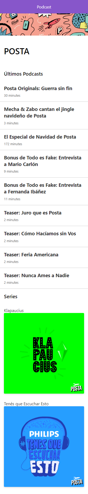

#APP de Podcast

App de podcast integrada con la API de audioBoom con Nex.js.

## ¿Como funciona?

Requiere NodeJS, React

*`npm install` para instalar las dependencias.
*`npm run dev` entorno de desarrollo.
*`npm run build && npm start` entorno de producción.

## Licencia

MIT